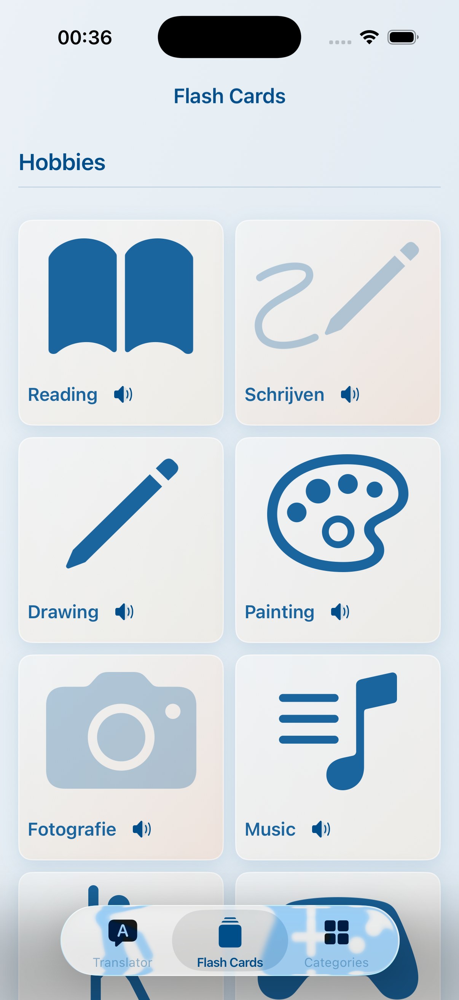
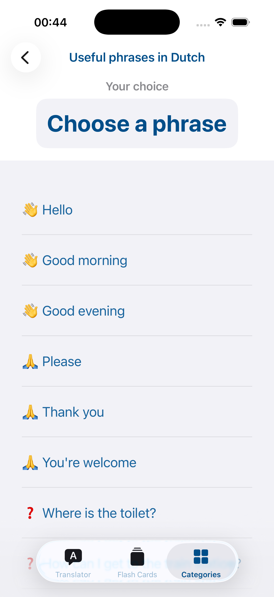
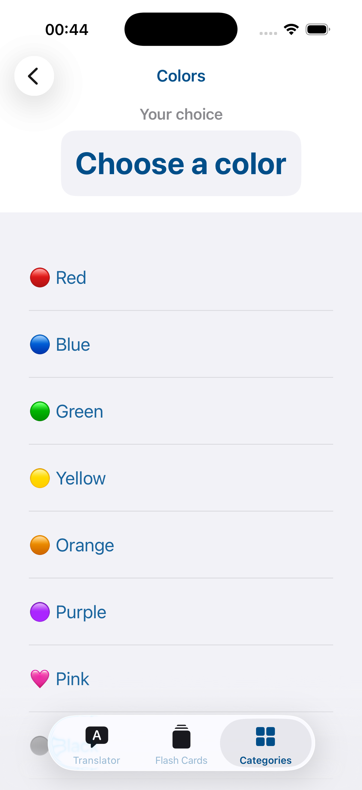

# 🇳🇱 Easy Dutch

Интерактивное iOS-приложение для изучения голландского языка. Учебный проект — практика UIKit, SwiftUI, анимаций и сетевых запросов.

---

## Скриншоты

| Экран | |
|---|---|
|  | Переводчик EN → NL |
|  | Flash Cards — хобби |
|  | Категории |
|  | Места в городе |
|  | Животные |
|  | Блюда |
|  | Полезные фразы |
|  | Цвета |
|  | Числа |
|  | Распорядок дня |
|  | Покупки |
