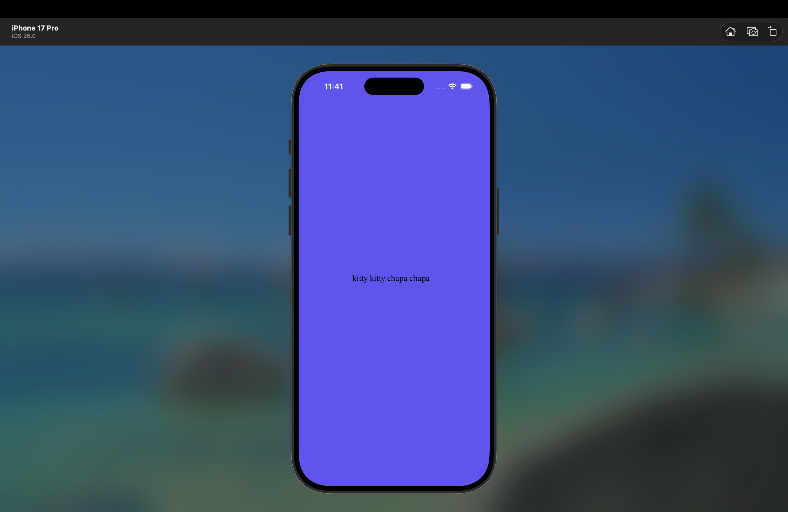
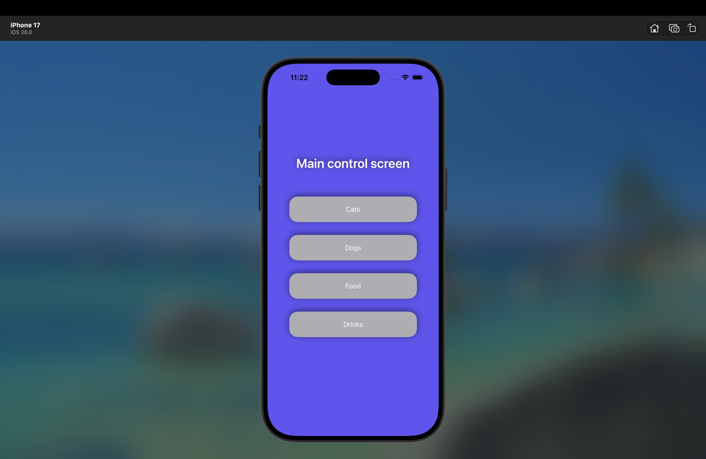
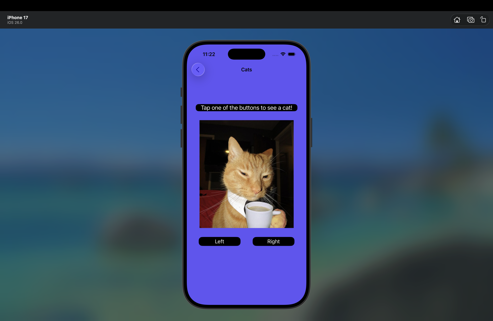
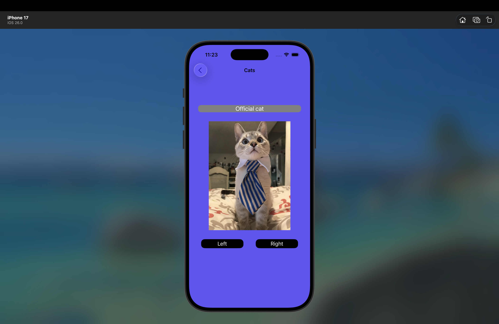
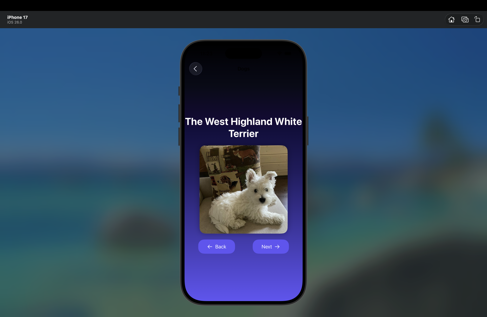
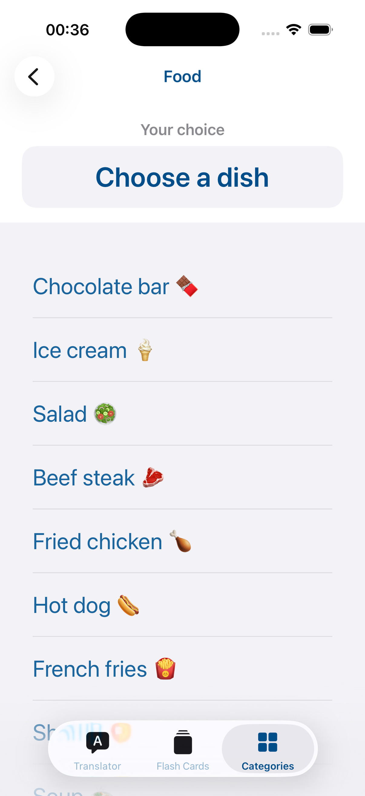
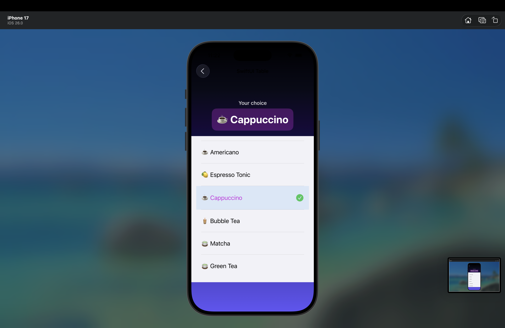

# На данный момент описание неактульно - приложение в работе!
*Гибридное iOS-приложение с навигацией между 4 экранами: UIKit + SwiftUI*

  
  

---

## Структура приложения

Приложение построено на **`UINavigationController`** как корневом контроллере. Главный экран — меню навигации с 4 кнопками для перехода на целевые экраны.

| Экран         | Технология | Контент                     | Особенности                                      |
|---------------|------------|-----------------------------|--------------------------------------------------|
| **Главное меню** | UIKit      | Кнопки навигации            | Программный интерфейс, Auto Layout, адаптивная сетка |
| **Котики**      | UIKit      | Изображения из `cats/`      | Анимированный переход ←/→, плавное затухание    |
| **Собачки**     | SwiftUI    | 10 пород из `dogs/`         | Зацикленный горизонтальный скролл, градиентный фон |
| **Еда**         | SwiftUI    | Список блюд                 | `List` с изображениями, названиями, описанием    |
| **Напитки**     | SwiftUI    | Список напитков             | Аналогично экрану «Еда», отдельный контент       |

---

## Гибридная интеграция

- Все SwiftUI-экраны (`DogPickerViewController`, `DrinkListView`) обёрнуты в `UIHostingController`
- UIKit-экраны (`CatsPickerViewController`, `MainNavigationViewController`) управляются напрямую через `UINavigationController`
---

## Дизайн и анимации

- **UIKit-экраны**: программные констрейнты, плавные анимации через `UIView.animate`
- **SwiftUI-экраны**:
  - Собачки: `.scrollIndicators(.hidden)`, кастомный `GeometryReader` для зацикливания
  - Таблицы: разделители, аккуратные ячейки с `HStack`, адаптивные отступы
- Единый стиль кнопок (ButtonStyle.swift) применен для MainNavigationViewContoller для избежания дублировнаия кода

---

## Скриншоты

| Экран             | Изображение                                                                 |
|-------------------|-----------------------------------------------------------------------------|
| **Launch Screen** |                                      |
| **Главное меню**  |                                            |
| **Котики (1)**    |                                               |
| **Котики (2)**    |                                               |
| **Собачки (1)**   |                                                |
| **Еда (1)**       |                                               |
| **Eда (2)**       |                                             |
| **Напитки (1)**   |                                            |
| **Напитки (2)**   |                                            |
---

## Технологический стек

- **UIKit**: навигация, экран котиков, еды, главное меню
- **SwiftUI**: экраны собак, напитков
- **Мост**: `UIHostingController` для интеграции SwiftUI в стек UIKit
- **Layout**: 100% программные констрейнты (без Storyboard/XIB)
- **Assets**: структурированный каталог ресурсов
- **Поддержка**: iOS 16+, адаптация под все размеры экранов

---

## Архитектура MVC

KittenPicsApp/
├── App/                          # Точка входа в приложение
│   ├── AppDelegate.swift         # Жизненный цикл приложения
│   └── SceneDelegate.swift       # Управление сценами (UIWindow)
│
├── Models/                       # Слои данных и бизнес-модели
│   └── FlashCard.swift           # Модель для флеш-карточек (EN ↔ NL)
│
├── ViewControllers/              # UIKit контроллеры
│   ├── CollectionViewController/
│   │   └── UICollectionViewController.swift  # Коллекция с городами
│   ├── CityPlacesPickerViewController.swift
│   ├── FoodTableViewController.swift
│   └── MainNavigationViewController.swift    # Главный навигационный контроллер
│
├── SwiftUIViews/                 # SwiftUI представления
│   ├── AnimalsPickerView.swift
│   └── BasicPhrasesViewList.swift
│
├── Views/                        # Кастомные UI компоненты
│   └── Cells/                    # Ячейки для коллекций и таблиц
│       ├── NorthHollandCollectionViewCell.swift
│       └── ProfessionsCollectionViewCell.swift
│
├── Extensions/                   # Расширения стандартных классов
│   ├── ButtonStyle.swift         # Кастомные стили кнопок
│   └── ColorPalette.swift        # Цветовая палитра приложения
│
└── Resources/                    # Ресурсы (ассеты, storyboard, plist)
    ├── Assets.xcassets
    ├── Info.plist
    └── LaunchScreen.storyboard
