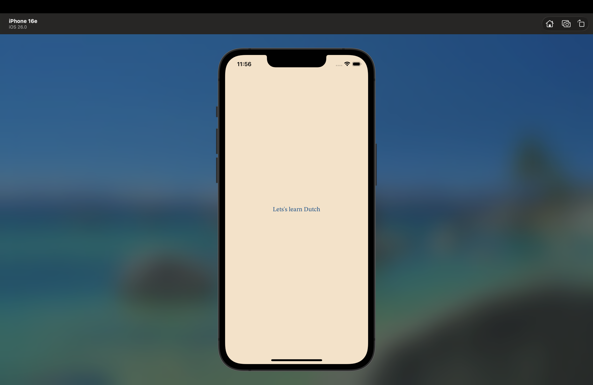
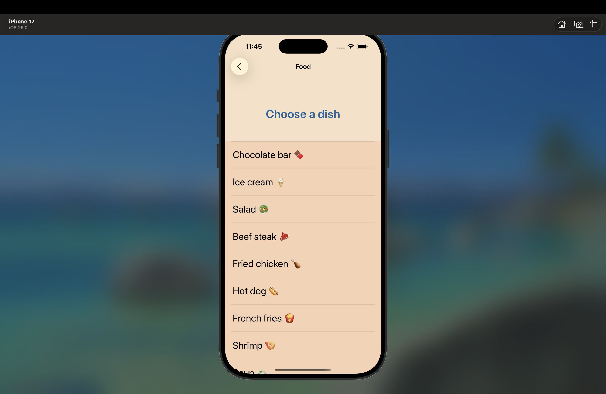
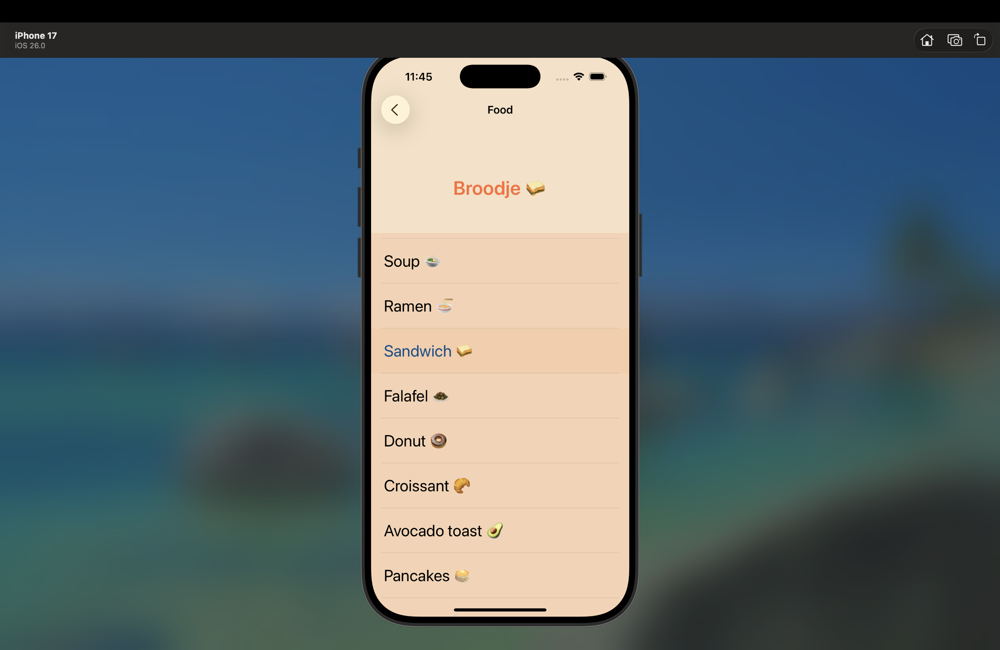
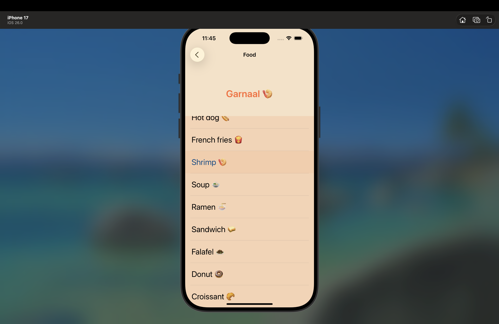

# 🇳 Easy Dutch

**Интерактивное iOS-приложение для изучения голландского языка с флеш-карточками**

---

>  **Ремарка:** Это **учебный проект**, созданный в первую очередь для изучения и практики работы с различными элементами UI как в **UIKit**, так и в **SwiftUI**. Основная цель — эксперименты с анимациями, коллекциями, градиентами и интеграцией двух фреймворков.

---

## 📖 Описание

**Easy Dutch** — это гибридное iOS-приложение для изучения голландского языка с помощью интерактивных флеш-карточек. Приложение сочетает **UIKit** и **SwiftUI** для создания современного и отзывчивого пользовательского интерфейса.

### ✨ Основные возможности

| Фича | Описание |
|------|----------|
| 🎴 | Интерактивные карточки с 3D-анимацией переворота |
| 📚 | Категории: хобби, профессии, города |
| 🇬🇧🇳🇱 | Перевод: английский ↔ голландский |
| 🎨 | Градиентный дизайн с плавными переходами |
| 📱 | Полностью программный UI (Auto Layout в коде) |

---

## Скриншоты

| Экран             | Изображение                                                                 |
|-------------------|-----------------------------------------------------------------------------|
| **Launch Screen** |                                      |
| **Главное меню**  |                                            |
| **Страница для изучения названий различных мест в городе и организаций (1)**    |                                               |
| **Страница для изучения названий различных мест в городе и организаций (2)**    |                                               |
| **Страница для изучения названий различных мест в городе и организаций (2)**    |                                               |
| **Страница для изучения названий животных (1)**    |                                               |
| **Страница для изучения названий животных (2)**    |                                               |
| **Страница для изучения названий животных (3)**    |                                               |
| **Страница для изучения названий блюд (1)**       |                                               |
| **Страница для изучения названий блюд (2)**       |                                             |
| **Страница для изучения названий блюд (3)**       |                                             |
| **Страница для изучения полезных фраз (1)**       |                                             |
| **Страница для изучения полезных фраз (2)**       |                                             |
| **Страница для изучения полезных фраз (3)**       |                                             |
| **Страница для названий профессий и хобби (1)**       |                                             |
| **Страница для названий профессий и хобби (2)**       |                                             |
| **Страница для названий профессий и хобби (3)**       |                                             |
---

