# 🇳 Easy Dutch

**Интерактивное iOS-приложение для изучения голландского языка с флеш-карточками**

[](https://swift.org)
[](https://developer.apple.com/ios)
[](https://developer.apple.com/uikit)
[](https://developer.apple.com/swiftui)

---

>  **Ремарка:** Это **учебный проект**, созданный в первую очередь для изучения и практики работы с различными элементами UI как в **UIKit**, так и в **SwiftUI**. Основная цель — эксперименты с анимациями, коллекциями, градиентами и интеграцией двух фреймворков.

---

## 📖 Описание

**Easy Dutch** — это гибридное iOS-приложение для изучения голландского языка с помощью интерактивных флеш-карточек. Приложение сочетает **UIKit** и **SwiftUI** для создания современного и отзывчивого пользовательского интерфейса.

### ✨ Основные возможности

| Фича | Описание |
|------|----------|
| 🎴 | Интерактивные карточки с 3D-анимацией переворота |
| 📚 | Категории: хобби, профессии, города |
| 🇬🇧🇳🇱 | Перевод: английский ↔ голландский |
| 🎨 | Градиентный дизайн с плавными переходами |
| 📱 | Полностью программный UI (Auto Layout в коде) |

---

## Скриншоты

| Экран             | Изображение                                                                 |
|-------------------|-----------------------------------------------------------------------------|
| **Launch Screen** |                                      |
| **Главное меню**  | 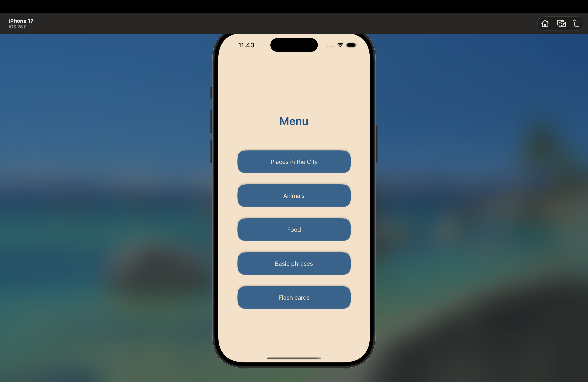                                           |
| **Страница для изучения названий различных мест в городе и организаций (1)**    | 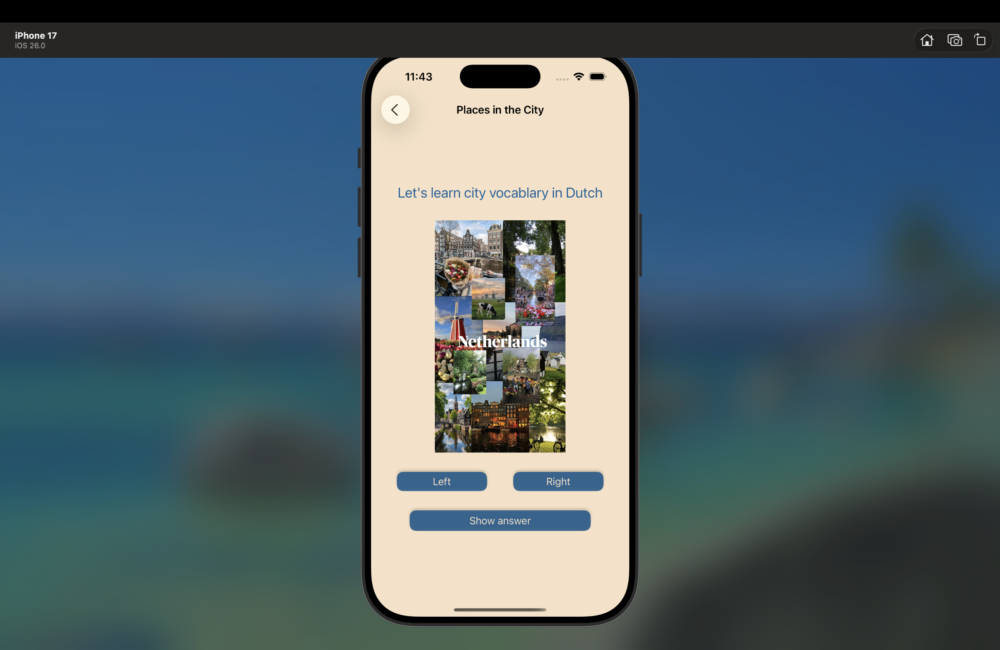                                              |
| **Страница для изучения названий различных мест в городе и организаций (2)**    | 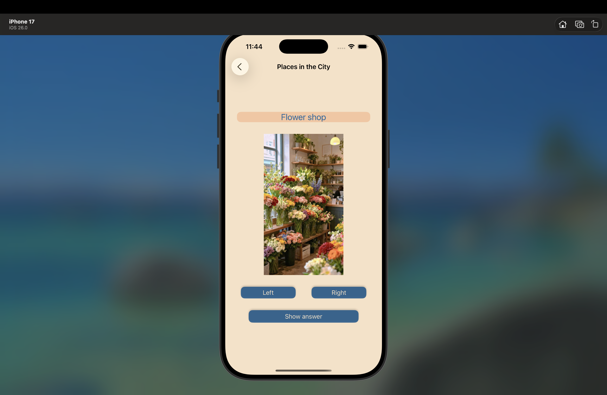                                              |
| **Страница для изучения названий различных мест в городе и организаций (2)**    | 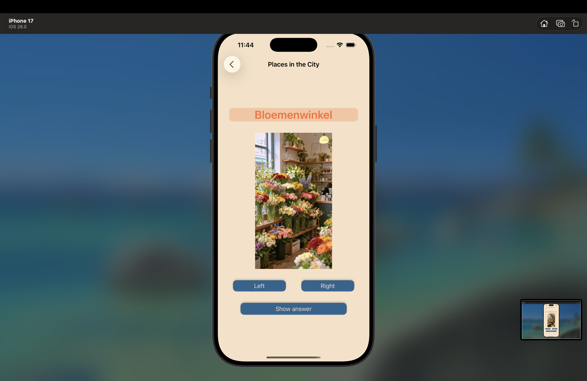                                              |
| **Страница для изучения названий животных (1)**    | 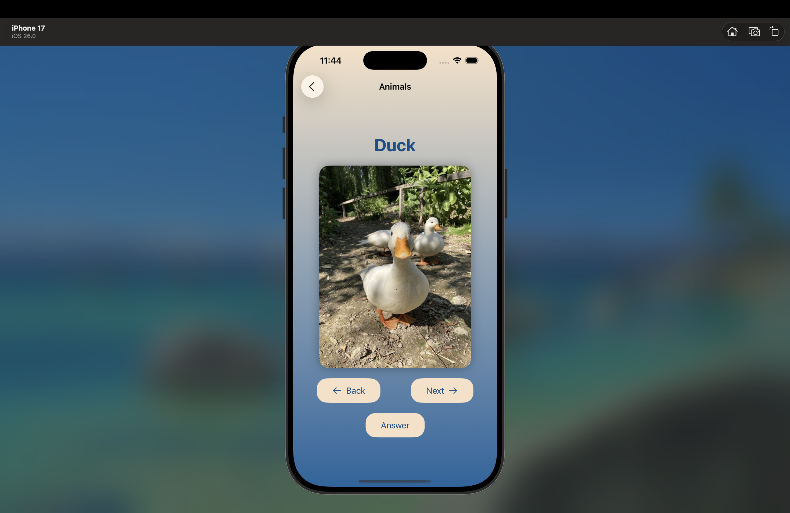                                              |
| **Страница для изучения названий животных (2)**    | 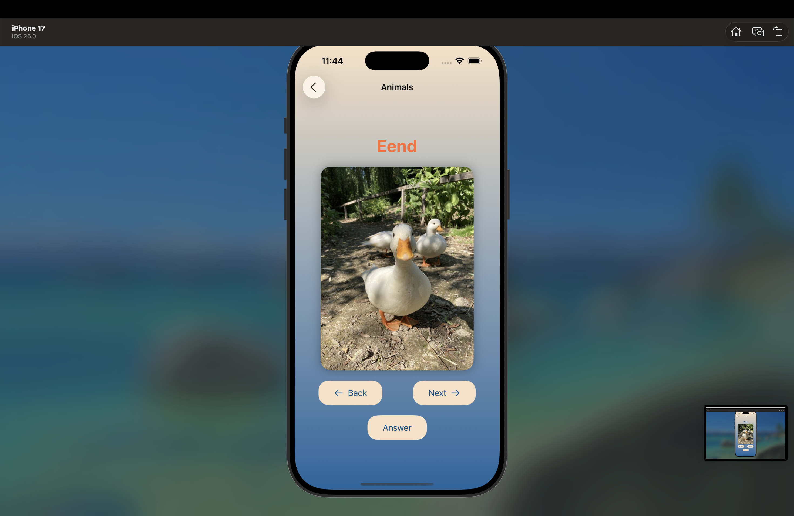                                              |
| **Страница для изучения названий животных (3)**    |                                               |
| **Страница для изучения названий блюд (1)**       |                                               |
| **Страница для изучения названий блюд (2)**       |                                             |
| **Страница для изучения названий блюд (3)**       |                                             |
| **Страница для изучения полезных фраз (1)**       | 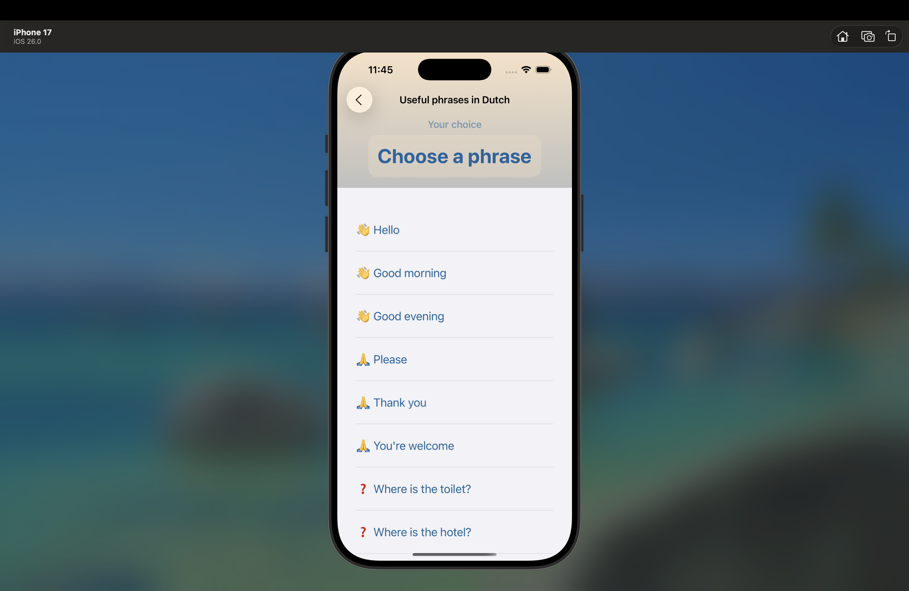                                            |
| **Страница для изучения полезных фраз (2)**       |                                             |
| **Страница для изучения полезных фраз (3)**       | 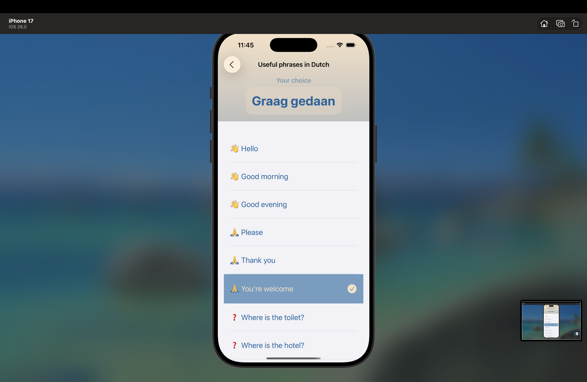                                            |
| **Страница для названий профессий и хобби (1)**       | 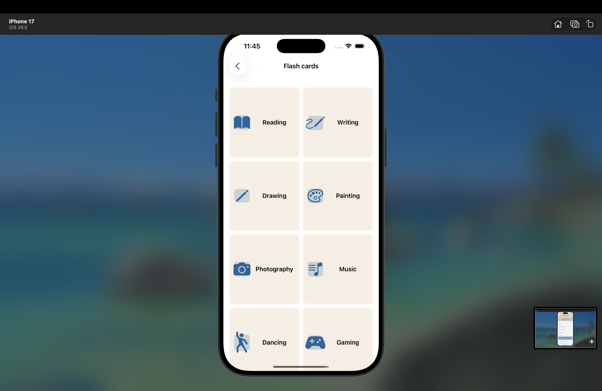                                            |
| **Страница для названий профессий и хобби (2)**       | 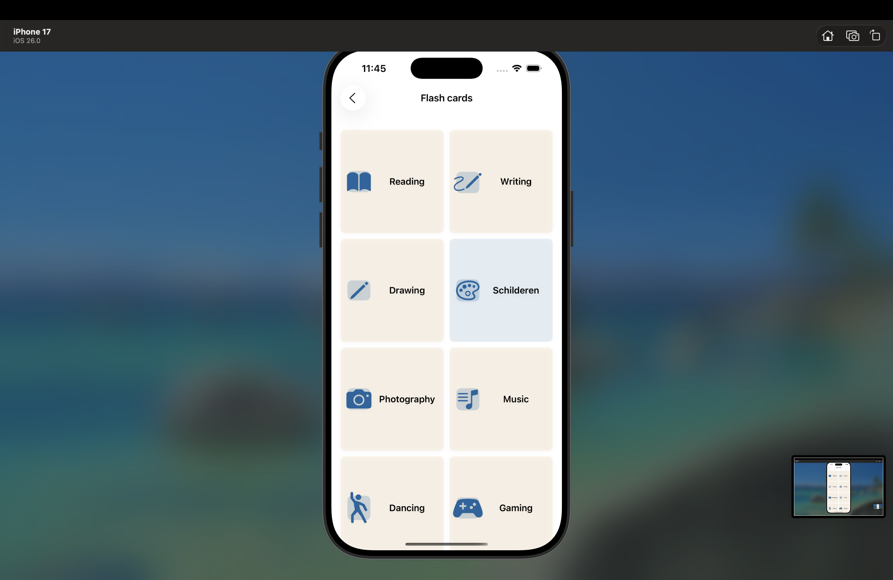                                            |
| **Страница для названий профессий и хобби (3)**       | 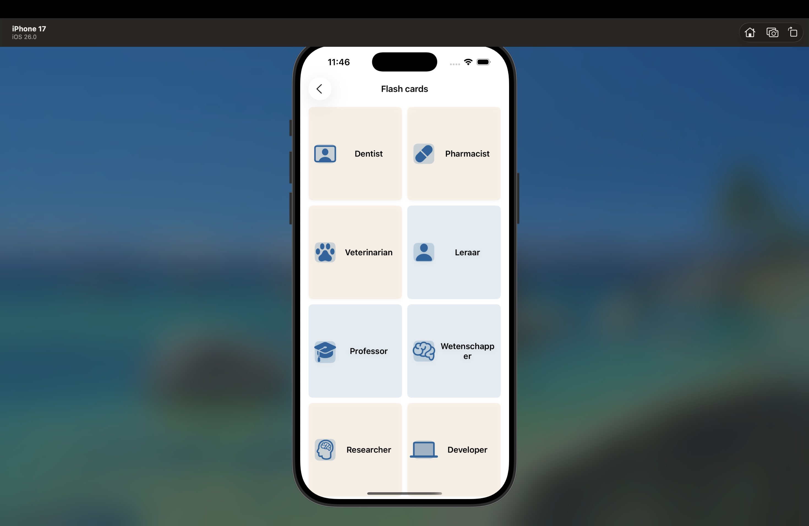                                            |
---

## 🏗️ Архитектура проекта - MVC

```
EasyDutch/
├── App/                               # Точка входа в приложение
│   ├── AppDelegate.swift              # Жизненный цикл приложения
│   └── SceneDelegate.swift            # Управление сценами
│
├── Models/                            # Слои данных и бизнес-модели
│   └── FlashCard.swift                # Модель данных карточки
│
├── ViewControllers/                   # UIKit контроллеры
│   ├── CollectionViewController/
│   │   └── UICollectionViewController.swift
│   ├── MainNavigationViewController.swift                # Главный навигационный контроллер
│   ├── CityPlacesPickerViewController.swift
│   └── FoodTableViewController.swift
│
├── SwiftUIViews/                      # SwiftUI представления
│   ├── AnimalsPickerView.swift
│   └── BasicPhrasesViewList.swift
│
├── Views/                             # Кастомные UI компоненты
│   └── Cells/                         # Ячейки для коллекции
│       ├── HobbiesCollectionViewCell.swift
│       └── ProfessionsCollectionViewCell.swift
│
└── Extensions/
    ├── ButtonStyle.swift              # Кастомный стиль кнопок
    └── ColorPalette.swift             # Цветовая палитра приложения
```

---

## 📱 Экраны приложения и используемые технологии

### 1️⃣ Главный экран навигации (Main Navigation)

| Параметр | Значение |
|----------|----------|
| **Файл** | `MainNavigationViewController.swift` |
| **Технология** | **UIKit** |

**Описание:**  
Центральный экран приложения с кнопками для перехода в различные разделы (хобби, профессии, животные, фразы и т.д.).

**Используемые технологии:**
- `UIViewController` — базовый контроллер
- `UIButton` — кнопки навигации с кастомными стилями
- `UIStackView` — вертикальное расположение кнопок
- `Auto Layout` (программный) — адаптивная вёрстка
- **Кастомные расширения** — `ButtonStyle.swift` для единого стиля кнопок
- **ColorPalette** — централизованное управление цветами

---

### 2️⃣ Коллекция слов (UICollectionView с флеш-карточками)

| Параметр | Значение |
|----------|----------|
| **Файл** | `UICollectionViewController.swift` |
| **Технология** | **UIKit** |

**Описание:**  
Основной экран с коллекцией интерактивных карточек. Содержит две секции: **Хобби** (2 колонки) и **Профессии** (1 колонка).

**Используемые технологии:**
```swift
// Протоколы
UICollectionViewDelegate              // Обработка нажатий и скролла
UICollectionViewDataSource          // Поставка данных
UICollectionViewDelegateFlowLayout  // Кастомные размеры ячеек
UICollectionViewFlowLayout          // Базовый layout
```

**Ключевые фичи:**
- **Reusable Cells** — паттерн `dequeueReusableCell`
- **Type Safety** — enum для секций вместо magic numbers
- **Динамический расчёт размеров** — адаптация под любой экран
- **Множественные типы ячеек** — разные layouts для разных секций

---

### 3️⃣ Ячейка хобби (Hobbies Card)

| Параметр | Значение |
|----------|----------|
| **Файл** | `HobbiesCollectionViewCell.swift` |
| **Технология** | **UIKit** |

**Описание:**  
Карточка с иконкой (SF Symbol) для изучения названий хобби на голландском. Поддерживает анимацию переворота.

**Используемые технологии:**
```swift
// UI Components
UILabel           // Текст (английское/голландское слово)
UIImageView       // SF Symbol иконка
UIView            // Контейнер с закруглением и тенью
```

**Ключевые фичи:**
- **3D Flip Animation** — плавный переворот карточки
- **Haptic Feedback** — тактильная отдача при нажатии
- **SF Symbols** — векторные иконки Apple
- **Auto Layout** — программные констрейнты
- **prepareForReuse()** — сброс состояния при реюзке

---

### 4️⃣ Ячейка профессий (Professions Card)

| Параметр | Значение |
|----------|----------|
| **Файл** | `ProfessionsCollectionViewCell.swift` |
| **Технология** | **UIKit** |

**Описание:**  
Карточки для изучения названий профессий на голландском. Также поддерживает анимацию переворота.

**Используемые технологии:**
- `UILabel` × 2 (название + подзаголовок)
- `UIImageView` — иконка профессии
- `UIView.transition` — анимация переворота
- `Auto Layout` — горизонтальное расположение элементов

---

### 5️⃣ Выбор животных (Animals Picker)

| Параметр | Значение |
|----------|----------|
| **Файл** | `AnimalsPickerView.swift` |
| **Технология** | **SwiftUI** |

**Описание:**  
Экран с `Picker` для изучения названий животных на голландском. Демонстрирует работу SwiftUI компонентов.

**Используемые технологии:**
```swift
@State              // State management
Picker              // SwiftUI Picker component
ForEach             // Итерация по массиву данных
Text, Image         // Базовые SwiftUI views
```

**Ключевые фичи:**
- **Declarative UI** — описание интерфейса через body
- **@State** — реактивное управление состоянием
- **WheelPickerStyle** — нативный iOS picker

---

### 6️⃣ Базовые фразы (Basic Phrases List)

| Параметр | Значение |
|----------|----------|
| **Файл** | `BasicPhrasesViewList.swift` |
| **Технология** | **SwiftUI** |

**Описание:**  
Список полезных голландских фраз с переводами.

**Используемые технологии:**
```swift
List              // SwiftUI List (аналог UITableView)
NavigationView    // Навигационный контейнер
Text              // Отображение текста
```

**Ключевые фичи:**
- **List** — автоматический reuse ячеек
- **NavigationView** — нативная навигация SwiftUI
- **Declarative syntax** — лаконичный код

---

### 7️⃣ Города (City Places Picker)

| Параметр | Значение |
|----------|----------|
| **Файл** | `CityPlacesPickerViewController.swift` |
| **Технология** | **UIKit** |

**Описание:**  
Классический `UIPickerView` изучения названий различных общественных мест города: машазины, больницы, школы и др.

**Используемые технологии:**
```swift
UIPickerView              // Стандартный picker
UIPickerViewDataSource    // Поставка данных
UIPickerViewDelegate      // Обработка выбора
```

---

### 8️⃣ Еда (Food Table View)

| Параметр | Значение |
|----------|----------|
| **Файл** | `FoodTableViewController.swift` |
| **Технология** | **UIKit** |

**Описание:**  
Классическая `UITableView` со списком продуктов/блюд для изучения их названий.

**Используемые технологии:**
```swift
UITableView
UITableViewDataSource
UITableViewDelegate
UITableViewCell
```

**Ключевые фичи:**
- **UITableView** — вертикальный список
- **Reusable Cells** — паттерн `dequeueReusableCell`
- **Section support** — группировка по категориям


## 🛠️ Полный технологический стек

### Основные фреймворки
| Фреймворк | Назначение |
|-----------|------------|
| **UIKit** | Основной UI: коллекции, таблицы, навигация |
| **SwiftUI** | Дополнительные экраны: пикеры, списки |
| **Foundation** | Модели данных, работа с массивами |

### UI Components
| Компонент | Использование |
|-----------|---------------|
| **UICollectionView** | Коллекция флеш-карточек |
| **UITableView** | Списки (еда, фразы) |
| **UIPickerView** | Выбор мест в городе/животных |
| **UIButton** | Навигация |
| **UILabel** | Текст |
| **UIImageView** | Иконки SF Symbols |

### Анимации и графика
| Технология | Назначение |
|------------|------------|
| **UIView.transition** | 3D flip анимация карточек |
| **UIImpactFeedbackGenerator** | Haptic feedback |
| **SF Symbols** | Векторные иконки |
| **CALayer** | Тени, скругления |

### Архитектура и паттерны
| Паттерн | Реализация |
|---------|------------|
| **MVC** | Model-View-Controller |
| **Delegation** | UICollectionViewDelegate/DataSource |
| **Reusable Cells** | dequeueReusableCell + configure() |
| **Type Safety** | enum CollectionSectionType |
| **Dependency Injection** | configure(with: FlashCard) |
| **Programmatic UI** | Auto Layout в коде |

---

## 📚 Что я использовала в этом проекте

### UIKit
- UICollectionView с множественными типами ячеек
- UICollectionViewDelegateFlowLayout
- Programmatically Auto Layout (NSLayoutConstraint)
- UIView.transition для анимаций
- UIImpactFeedbackGenerator
- Reusable cells pattern

### SwiftUI
- Declarative UI syntax
- @State для управления состоянием
- Picker, List, NavigationView
- Интеграция с UIKit через UIHostingController

### Архитектура
- MVC pattern
- Type-safe enums
- Separation of Concerns
- Reusable components
- Clean code principles

---


<div align="center">
  <sub>Сделано с ❤️ для изучения UIKit, SwiftUI и голландского языка 🇳🇱</sub>
</div>
```
