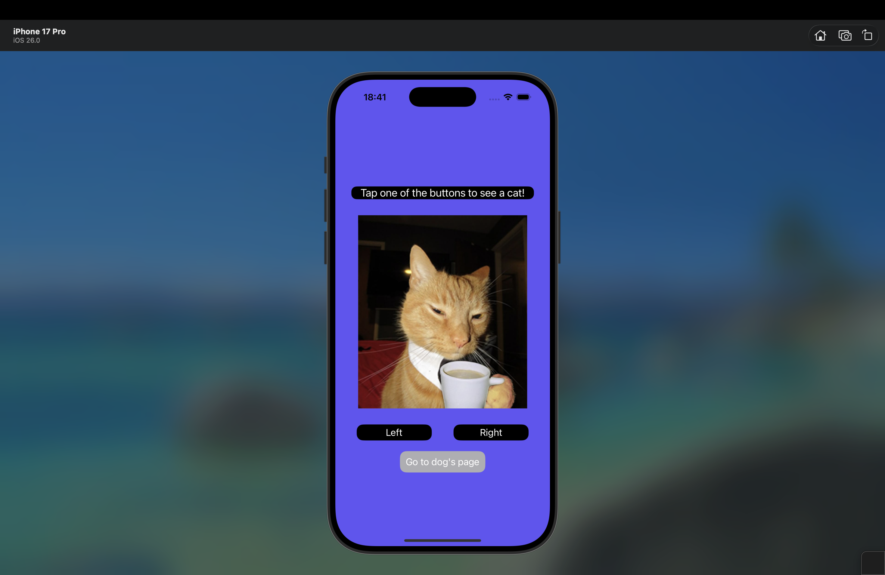
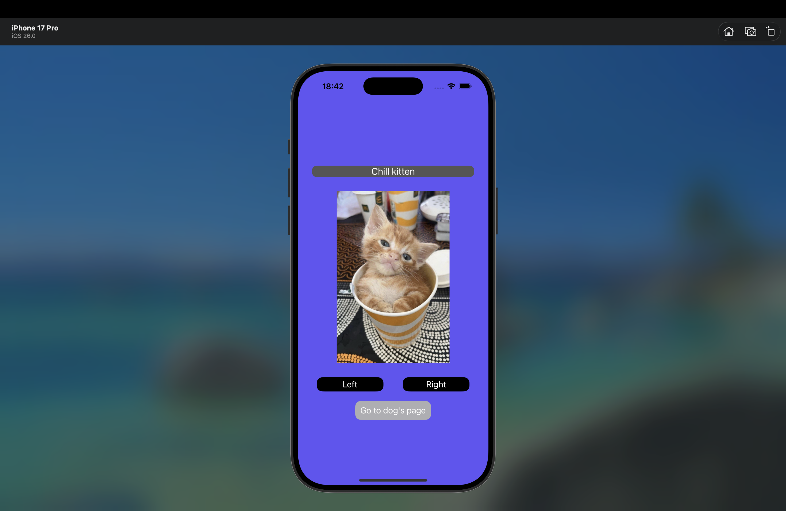
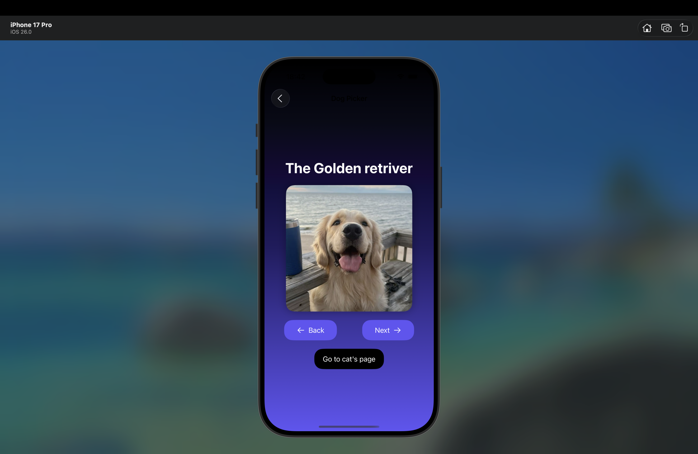
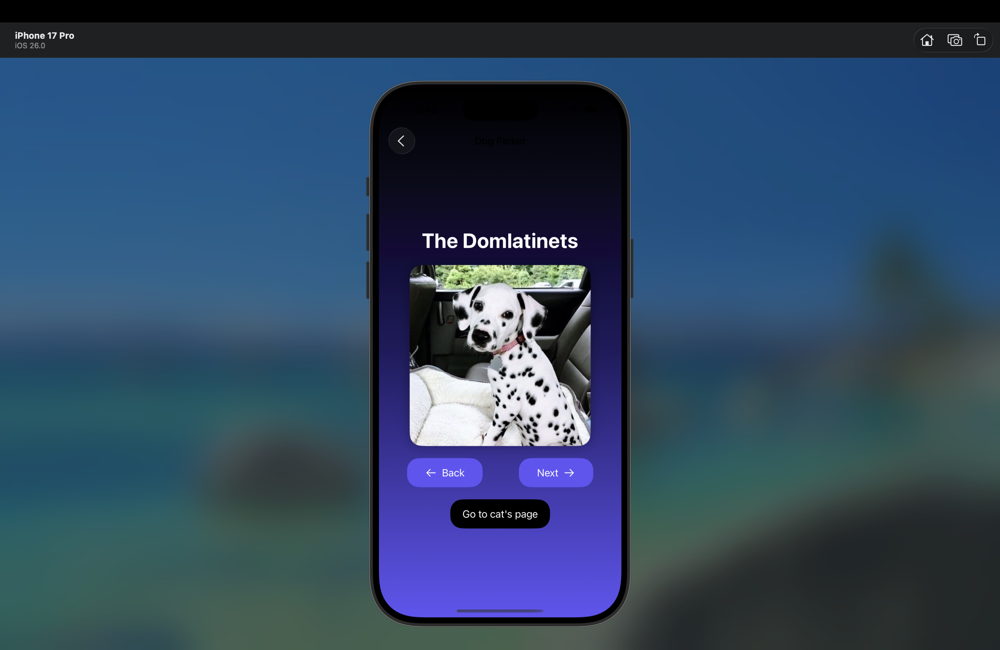

# Pet Explorer

Домашняя работа №1. Гибридное iOS-приложение для просмотра изображений животных: котиков на первом экране (UIKit) и собачек на втором (SwiftUI).

### Основной экран (UIKit)
- Переключение изображений котиков кнопками ← / →
- Плавная анимация смены изображений
- Полностью программный интерфейс 

### Второй экран — Dog Picker (SwiftUI)
-  Просмотр 10 пород собак 
-  Зацикленная навигация (бесконечный скролл ← →)
-  Адаптивный интерфейс с градиентным фоном

## Архитектура

| Экран | Технология | Подход |
|-------|------------|--------|
| **Главный экран** | UIKit | Чистый код, Auto Layout через Constraints |
| **Dog Picker** | SwiftUI | Декларативный интерфейс с `@State` |
| **Интеграция** | `UIHostingController` | Мост между мирами UIKit ↔ SwiftUI |

## Технологии

- **UIKit** — основной экран с динамическими изображениями
- **SwiftUI** — второй экран с реактивной навигацией
- **Гибридная архитектура** — плавная интеграция через `UIHostingController`
- **Auto Layout** — адаптивный интерфейс без Storyboard
- **Assets Catalog** — организованные изображения в группах (`cats/`, `dogs/`)

## Скриншоты

### Главный экран (котики) - UIKit

### Dog Picker (собачки) - SwiftUI

